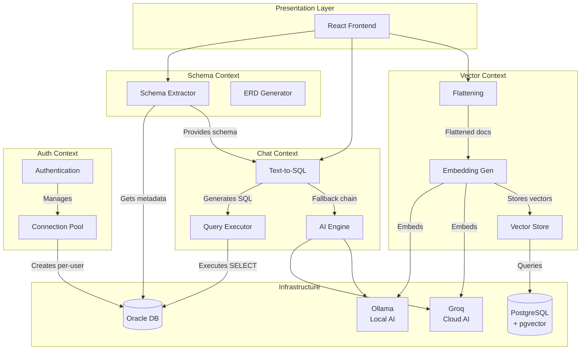

# Context Map - Phase 2: Strategic Design

## 1. Bounded Contexts Identified

Dựa trên Event Storming, hệ thống được phân chia thành **4 Bounded Contexts**:

```
┌─────────────────────────────────────────────────────────────────────────────┐
│                         ORACLE AI WORKSPACE                                  │
├─────────────────┬─────────────────────┬──────────────────┬─────────────────┤
│     SCHEMA      │       CHAT          │      VECTOR      │      AUTH       │
│    CONTEXT      │     CONTEXT         │     CONTEXT      │    CONTEXT      │
├─────────────────┼─────────────────────┼──────────────────┼─────────────────┤
│ Schema          │ Text-to-SQL         │ Embedding        │ User            │
│ Extraction      │ Chat                │ Search           │ Authentication  │
│ ERD             │ AI Fallback         │ Flattening       │ Connection      │
│ Visualization   │ History             │ Vector Store     │ Management      │
└─────────────────┴─────────────────────┴──────────────────┴─────────────────┘
```

---

## 2. Context Mapping Diagram



---

## 3. Relationships Between Contexts

### 3.1 Schema Context → Chat Context (Upstream)

| Aspect | Chi tiết |
|--------|----------|
| **Relationship** | Upstream/Downstream |
| **Direction** | Schema → Chat |
| **Interface** | Schema JSON được gắn vào prompt |
| **Rationale**: | Chat Context cần schema metadata để generate SQL. Không có schema thì AI không biết table/column names. |

### 3.2 Schema Context → Vector Context (Upstream)

| Aspect | Chi tiết |
|--------|----------|
| **Relationship** | Upstream/Downstream |
| **Direction** | Schema → Vector |
| **Interface** | Table metadata (table_name, columns) |
| **Rationale**: | Vector Context cần biết table structure để flatten rows đúng cách. |

### 3.3 Auth Context → Schema/Chat/Vector (Upstream)

| Aspect | Chi tiết |
|--------|----------|
| **Relationship** | Upstream (Shared Kernel with ACL) |
| **Direction** | Auth → All |
| **Interface** | User context, Connection pool |
| **Rationale**: | Auth cung cấp user identity và connection. Mọi context đều cần xác thực trước khi truy cập. |

### 3.4 Chat Context ↔ Vector Context (Customer/Supplier)

| Aspect | Chi tiết |
|--------|----------|
| **Relationship** | Customer/Supplier (Optional) |
| **Directione** | Bidirectional |
| **Interface** | Query results |
| **Rationale**: | Có thể dùng semantic search để enhance Text-to-SQL. Nhưng không bắt buộc. |

---

## 4. Anti-Corruption Layers (ACL)

### 4.1 Schema → Chat ACL

```
┌──────────────────┐      ┌──────────────────┐      ┌──────────────────┐
│   Schema JSON    │ ───► │ SchemaAdapter    │ ───► │ PromptBuilder    │
│   (Internal)     │      │ (ACL)            │      │ (Chat Domain)    │
└──────────────────┘      └──────────────────┘      └──────────────────┘
```

**Adapter Responsibility:**
- Chuyển đổi schema metadata sang format phù hợp cho prompt
- Lọc chỉ lấy relevant tables (dựa trên query context)
- Handle schema changes gracefully

### 4.2 Auth → Oracle Connection ACL

```
┌──────────────────┐      ┌──────────────────┐      ┌──────────────────┐
│   User Object   │ ───► │ ConnectionFactory│ ───► │ Oracle Connection│
│   (Auth Domain)  │      │ (ACL)            │      │ (Oracle Domain)  │
└──────────────────┘      └──────────────────┘      └──────────────────┘
```

**Adapter Responsibility:**
- Tạo per-user Oracle connection
- Quản lý connection pooling
- Handle connection timeouts

---

## 5. Shared Kernel

### 5.1 Common Types

| Type | Shared Between | Mô tả |
|------|---------------|--------|
| `TableName` | Schema, Vector | Table identifier |
| `ColumnInfo` | Schema, Vector | Column metadata |
| `UserId` | Auth, All | User identifier |

### 5.2 Rationale for NOT Sharing

| Concept | Schema Context | Vector Context | Lý do |
|---------|----------------|----------------|-------|
| **Schema** | Table metadata (DDL) | Embedding metadata (cache) | Khác nhau về lifecycle và update frequency |
| **Query** | SQL generation | Vector similarity | Khác nhau hoàn toàn về ngữ nghĩa |

---

## 6. Context Responsibilities Summary

### 6.1 Schema Context (Core)

**Responsibilities:**
- Trích xuất metadata từ Oracle (ALL_TABLES, ALL_TAB_COLUMNS, ALL_CONSTRAINTS)
- Tạo ERD JSON cho D3.js visualization
- Cache schema metadata

**Does NOT do:**
- Không execute user queries
- Không generate embeddings

### 6.2 Chat Context (Core)

**Responsibilities:**
- Nhận câu hỏi tự nhiên
- Generate SQL via AI
- Validate SQL (SELECT only)
- Execute và return results
- Fallback chain: Groq → Ollama → Gemini

**Does NOT do:**
- Không trích xuất schema (phụ thuộc Schema Context)
- Không store embeddings

### 6.3 Vector Context (Supporting)

**Responsibilities:**
- Flatten Oracle rows thành text documents
- Generate embeddings via BGE-base
- Store vectors trong pgvector
- Semantic search với cosine similarity

**Does NOT do:**
- Không generate SQL
- Không authenticate users

### 6.4 Auth Context (Supporting)

**Responsibilities:**
- User registration/login
- JWT token management
- Per-user Oracle connection pool

**Does NOT do:**
- Không generate SQL
- Không create embeddings

---

## 7. Integration Patterns

### 7.1 REST API Boundaries

```
┌─────────────┐     ┌─────────────┐     ┌─────────────┐     ┌─────────────┐
│  /api/schema│     │  /api/chat  │     │  /api/vector│     │  /api/auth  │
├─────────────┤     ├─────────────┤     ├─────────────┤     ├─────────────┤
│ GET /tables │     │POST /query  │     │POST /embed  │     │POST /login  │
│ GET /erd    │     │GET /history │     │GET /search  │     │POST /register│
└─────────────┘     └─────────────┘     └─────────────┘     └─────────────┘
```

### 7.2 Event Flow (Async)

```
┌──────────────┐    Event Bus    ┌──────────────┐
│  Chat Context│ ──────────────► │ Vector Context│
│ (Query done) │                  │(Search ready) │
└──────────────┘                  └──────────────┘
```

**Note:** Hiện tại dùng synchronous call. Có thể chuyển sang async event-driven nếu cần scale.
