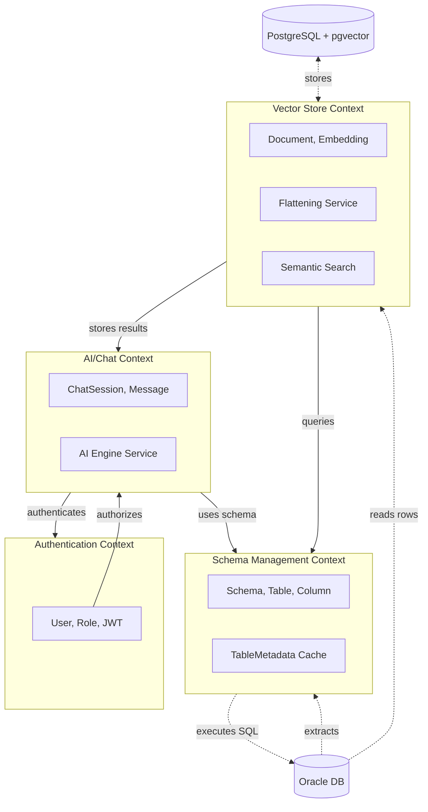

# Domain-Driven Design Analysis

## 1. Ubiquitous Language (Ngôn ngữ phổ quát)

### Danh từ (Nouns) - Entities & Value Objects

| Thuật ngữ | Mô tả | Loại |
|-----------|-------|------|
| **Schema** | Cấu trúc database (tables, columns, foreign keys) | Entity |
| **Table** | Bảng trong Oracle DB | Entity |
| **Column** | Cột trong bảng (name, type, nullable) | Value Object |
| **ForeignKey** | Ràng buộc khóa ngoại | Value Object |
| **User** | Người dùng hệ thống | Entity |
| **ChatSession** | Phiên chat Text-to-SQL | Entity |
| **Message** | Tin nhắn trong phiên chat | Entity |
| **Query** | Câu hỏi bằng ngôn ngữ tự nhiên | Value Object |
| **GeneratedSQL** | SQL được AI sinh ra | Value Object |
| **Document** | Row sau khi flatten | Entity |
| **Embedding** | Vector representation | Value Object |
| **TableMetadata** | Cache metadata của bảng | Entity |

### Động từ (Verbs) - Domain Services & Commands

| Hành động | Mô tả |
|-----------|-------|
| **Extract** | Trích xuất schema từ Oracle |
| **Visualize** | Hiển thị ERD bằng D3.js |
| **Convert** | Chuyển đổi Text-to-SQL |
| **Validate** | Kiểm tra SQL (chỉ SELECT) |
| **Execute** | Thực thi SQL trên Oracle |
| **Flatten** | Chuyển row thành document text |
| **Embed** | Tạo vector từ document |
| **Search** | Tìm kiếm semantic |
| **Authenticate** | Xác thực người dùng |
| **Authorize** | Phân quyền người dùng |

---

## 2. Domain Events (Sự kiện miền)

| Event | Thời điểm xảy ra | Aggregate gốc |
|-------|------------------|---------------|
| **SchemaExtracted** | Khi lấy metadata từ Oracle | Schema |
| **ERDGenerated** | Khi tạo JSON cho D3.js | Schema |
| **QuerySubmitted** | Khi user gửi câu hỏi | ChatSession |
| **SQLGenerated** | Khi AI sinh SQL | ChatSession |
| **SQLValidated** | Khi SQL được kiểm tra an toàn | ChatSession |
| **QueryExecuted** | Khi SQL chạy trên Oracle | ChatSession |
| **RowFlattened** | Khi row chuyển thành text | Document |
| **EmbeddingCreated** | Khi tạo vector từ document | Document |
| **EmbeddingStored** | Khi lưu vector vào pgvector | Document |
| **SearchPerformed** | Khi user tìm kiếm semantic | Search |
| **UserRegistered** | Khi user đăng ký | User |
| **UserLoggedIn** | Khi user đăng nhập | User |
| **TokenIssued** | Khi JWT được phát hành | User |

---

## 3. Bounded Contexts (Ngữ cảnh biên)

```
┌─────────────────────────────────────────────────────────────────────────────┐
│                        ORACLE-AI-WORKSPACE                                 │
│  ┌─────────────────┐  ┌─────────────────┐  ┌─────────────────┐              │
│  │   SCHEMA       │  │   AI/CHAT      │  │   VECTOR       │              │
│  │   CONTEXT      │  │   CONTEXT      │  │   CONTEXT      │              │
│  │                │  │                │  │                │              │
│  │  - Table       │  │  - ChatSession │  │  - Document   │              │
│  │  - Column      │  │  - Message     │  │  - Embedding  │              │
│  │  - ForeignKey  │  │  - GeneratedSQL│  │  - Search     │              │
│  └────────┬────────┘  └────────┬────────┘  └────────┬────────┘              │
│           │                    │                    │                       │
│           └────────────────────┼────────────────────┘                       │
│                                │                                              │
│                    ┌───────────▼───────────┐                               │
│                    │   AUTH CONTEXT        │                               │
│                    │                        │                               │
│                    │  - User                │                               │
│                    │  - Role                │                               │
│                    │  - JWT Token           │                               │
│                    └────────────────────────┘                               │
└─────────────────────────────────────────────────────────────────────────────┘
```

### Chi tiết từng Context:

| Context | Lý do tách | Core Domain Logic |
|---------|-----------|-------------------|
| **Schema Management** | Tách biệt logic trích xuất metadata khỏi business logic khác | Extract, Cache, Visualize |
| **AI/Chat** | Tách biệt xử lý AI khỏi data access | Text-to-SQL, Fallback chain |
| **Vector Store** | Tách biệt logic embedding/search khỏi core business | Flatten, Embed, Semantic Search |
| **Authentication** | Tách biệt security concerns | Auth, JWT, RBAC |

---

## 4. Aggregates & Entities

### 4.1 Schema Context

```
┌─────────────────────────────────────────────────────────────┐
│                    SCHEMA AGGREGATE                         │
│  ┌─────────────────┐     ┌─────────────────────────────┐  │
│  │   Schema        │────▶│   Table                     │  │
│  │   (Root)        │     │   - name: String            │  │
│  │                 │     │   - columns: List<Column>   │  │
│  │   - tables      │     │   - primaryKey: String      │  │
│  │   - extractedAt │     │   - foreignKeys: List<FK>   │  │
│  └─────────────────┘     └─────────────────────────────┘  │
│                                    │                        │
│                          ┌─────────▼─────────┐            │
│                          │   Column           │            │
│                          │   - name           │            │
│                          │   - dataType       │            │
│                          │   - nullable       │            │
│                          │   - isPrimaryKey   │            │
│                          └─────────────────────┘            │
│                                                             │
│  ┌─────────────────────────────────────────────────────────┐│
│  │   TableMetadata (Entity)                                ││
│  │   - tableName: String (ID)                               ││
│  │   - schemaJson: JSONB                                   ││
│  │   - rowCount: Long                                      ││
│  │   - lastSynced: Timestamp                               ││
│  └─────────────────────────────────────────────────────────┘│
└─────────────────────────────────────────────────────────────┘
```

**Aggregate Boundary**: Schema aggregate bao gồm Table, Column, ForeignKey - đảm bảo consistency khi extract/update metadata.

### 4.2 AI/Chat Context

```
┌─────────────────────────────────────────────────────────────┐
│                 CHAT SESSION AGGREGATE                       │
│  ┌─────────────────────────┐     ┌──────────────────────┐  │
│  │   ChatSession (Root)    │────▶│   Message            │  │
│  │                         │     │   - role: USER/AI    │  │
│  │   - sessionId: UUID    │     │   - content: String │  │
│  │   - userId: Long        │     │   - timestamp       │  │
│  │   - createdAt          │     │   - sqlQuery         │  │
│  │   - messages: List     │     │   - sqlResult        │  │
│  └─────────────────────────┘     └──────────────────────┘  │
│                                                             │
│  ┌─────────────────────────────────────────────────────────┐│
│  │   AIEngine (Domain Service)                              ││
│  │   + generateSQL(question, schema): GeneratedSQL        ││
│  │   + validateSQL(sql): boolean                           ││
│  │   + executeQuery(sql): ResultSet                        ││
│  │   + fallbackChain(): Groq → Ollama → Gemini             ││
│  └─────────────────────────────────────────────────────────┘│
└─────────────────────────────────────────────────────────────┘
```

**Aggregate Boundary**: ChatSession bao gồm Messages - đảm bảo conversation history nhất quán.

### 4.3 Vector Store Context

```
┌─────────────────────────────────────────────────────────────┐
│                  DOCUMENT AGGREGATE                          │
│  ┌─────────────────────────┐     ┌──────────────────────┐  │
│  │   Document (Root)       │────▶│   Embedding           │  │
│  │                         │     │   - vector: VECTOR    │  │
│  │   - id: Long            │     │   - model: String     │  │
│  │   - tableName: String   │     │   - createdAt         │  │
│  │   - rowId: String       │     └──────────────────────┘  │
│  │   - documentText: String│                                 │
│  │   - embedding: Embedding (VO)                            │  │
│  │   - createdAt          │                                 │
│  └─────────────────────────┘                                 │
│                                                             │
│  ┌─────────────────────────────────────────────────────────┐│
│  │   FlatteningService (Domain Service)                     ││
│  │   + flattenRow(row): String                             ││
│  │   + flattenBatch(rows): List<String>                    ││
│  └─────────────────────────────────────────────────────────┘│
│                                                             │
│  ┌─────────────────────────────────────────────────────────┐│
│  │   EmbeddingService (Domain Service)                      ││
│  │   + createEmbedding(text): Vector                       ││
│  │   + batchEmbed(texts): List<Vector>                      ││
│  │   + cosineSimilarity(v1, v2): Double                     ││
│  └─────────────────────────────────────────────────────────┘│
└─────────────────────────────────────────────────────────────┘
```

**Aggregate Boundary**: Document bao gồm Embedding - đảm bảo document và vector luôn đồng bộ.

### 4.4 Authentication Context

```
┌─────────────────────────────────────────────────────────────┐
│                     USER AGGREGATE                           │
│  ┌─────────────────────────┐     ┌──────────────────────┐  │
│  │   User (Root)           │────▶│   Role                │  │
│  │                         │     │   - name: String     │  │
│  │   - id: Long            │     │   - permissions      │  │
│  │   - username: String    │     └──────────────────────┘  │
│  │   - passwordHash        │                                 │
│  │   - email               │                                 │
│  │   - roles: List<Role>   │                                 │
│  │   - createdAt          │                                 │
│  └─────────────────────────┘                                 │
│                                                             │
│  ┌─────────────────────────────────────────────────────────┐│
│  │   AuthService (Domain Service)                           ││
│  │   + register(user): User                                ││
│  │   + login(credentials): JWT                              ││
│  │   + validateToken(token): Claims                         ││
│  │   + refreshToken(token): JWT                             ││
│  └─────────────────────────────────────────────────────────┘│
└─────────────────────────────────────────────────────────────┘
```

**Aggregate Boundary**: User bao gồm Roles - đảm bảo authorization nhất quán.

---

## 5. Context Map (Bản đồ ngữ cảnh)



### Relationships:

| From | To | Type | Reason |
|------|-----|------|--------|
| Chat Context | Schema Context | **Customer-Supplier** | Chat cần schema để generate SQL |
| Chat Context | Auth Context | **Conformist** | Chat phụ thuộc Auth để authorize |
| Vector Context | Schema Context | **Customer-Supplier** | Vector cần table metadata để flatten |
| Vector Context | Chat Context | **Partner** | Kết quả search có thể dùng trong chat |

---

## 6. Tổng kết

| Thành phần | Số lượng |
|------------|----------|
| Bounded Contexts | 4 |
| Aggregates | 4 (Schema, ChatSession, Document, User) |
| Domain Events | 13 |
| Domain Services | 6 |

---

## 7. Package Structure Đề xuất (DDD-Aligned)

```
backend/src/main/java/com/oracleai/workspace/
├── schema/                          # Schema Bounded Context
│   ├── domain/
│   │   ├── entity/
│   │   │   ├── Schema.java          # Aggregate Root
│   │   │   ├── Table.java
│   │   │   ├── Column.java
│   │   │   └── TableMetadata.java
│   │   ├── valueobject/
│   │   │   └── ForeignKey.java
│   │   └── service/
│   │       └── SchemaExtractor.java
│   ├── repository/
│   │   └── TableMetadataRepository.java
│   └── api/
│       └── SchemaController.java
│
├── chat/                            # AI/Chat Bounded Context
│   ├── domain/
│   │   ├── entity/
│   │   │   ├── ChatSession.java     # Aggregate Root
│   │   │   └── Message.java
│   │   ├── valueobject/
│   │   │   └── GeneratedSQL.java
│   │   └── service/
│   │       ├── TextToSQLService.java
│   │       └── SQLValidator.java
│   ├── repository/
│   │   └── ChatSessionRepository.java
│   └── api/
│       └── ChatController.java
│
├── vector/                          # Vector Store Bounded Context
│   ├── domain/
│   │   ├── entity/
│   │   │   └── Document.java        # Aggregate Root
│   │   ├── valueobject/
│   │   │   └── Embedding.java
│   │   └── service/
│   │       ├── FlatteningService.java
│   │       ├── EmbeddingService.java
│   │       └── SemanticSearchService.java
│   ├── repository/
│   │   └── DocumentRepository.java
│   └── api/
│       └── VectorController.java
│
├── auth/                            # Authentication Bounded Context
│   ├── domain/
│   │   ├── entity/
│   │   │   ├── User.java            # Aggregate Root
│   │   │   └── Role.java
│   │   └── service/
│   │       ├── AuthService.java
│   │       └── JwtService.java
│   ├── repository/
│   │   └── UserRepository.java
│   ├── security/
│   │   ├── JwtAuthenticationFilter.java
│   │   └── SecurityConfig.java
│   └── api/
│       └── AuthController.java
│
└── shared/                          # Shared Kernel
    ├── config/
    │   ├── OracleDataSourceConfig.java
    │   └── PostgreSQLDataSourceConfig.java
    ├── exception/
    │   └── GlobalExceptionHandler.java
    └── dto/
        └── ApiResponse.java
```
