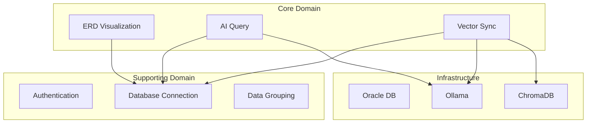

# Context Map - Oracle AI Data Visualizer

## Overview

## Bounded Contexts

### Core Domain
| Context | Type | Description |
|---------|------|-------------|
| ERD Visualization | Core | Interactive ERD rendering |
| AI Query | Core | Text-to-SQL generation |
| Vector Sync | Core | RDBMS to Vector DB |

### Supporting Domain
| Context | Type | Description |
|---------|------|-------------|
| Authentication | Generic | User management |
| Database Connection | Supporting | Oracle connection |
| Data Grouping | Supporting | Table organization |

## Integration Patterns

| Relationship | Pattern | Description |
|--------------|---------|-------------|
| AI Query → Ollama | Upstream/Downstream | AI generates SQL |
| Vector Sync → ChromaDB | Upstream/Downstream | Store embeddings |
| All → Authentication | Upstream/Downstream | All require auth |

## Shared Kernel
- **UserId**: Used across all contexts
- **ConnectionId**: Used in Database Connection, Schema, AI Query, Vector Sync
- **TableId**: Used in Schema, ERD, Data Grouping, Vector Sync
