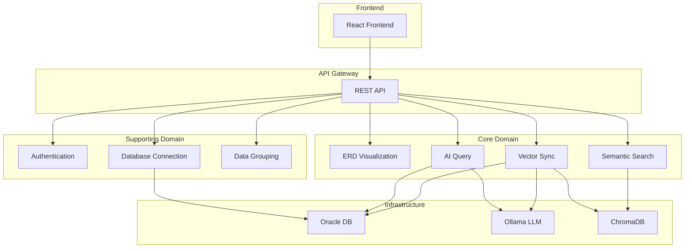

# Strategic Design - Oracle AI Data Visualizer

## 1. Bounded Contexts
| Context | Type | Responsibility |
|---------|------|----------------|
| Authentication | Generic | User registration, login, JWT token management |
| Database Connection | Supporting | Oracle DB connection, schema metadata extraction |
| ERD Visualization | Core | Interactive ERD rendering, diagram export |
| AI Query | Core | Text-to-SQL generation, query execution |
| Data Grouping | Supporting | Organization of tables into logical groups |
| Vector Sync | Core | RDBMS to Vector DB synchronization |
| Semantic Search | Core | Vector similarity search |

## 2. Context Map

## 3. Relationships
| From | To | Type | Integration |
|------|-----|------|-------------|
| ERD Visualization | Database Connection | Upstream→Downstream | Schema extracted via JDBC |
| AI Query | Database Connection | Upstream→Downstream | SQL executed on Oracle |
| AI Query | Ollama | Upstream→Downstream | LLM generates SQL |
| Vector Sync | Database Connection | Upstream→Downstream | Data extracted from Oracle |
| Vector Sync | Ollama | Upstream→Downstream | Generate embeddings |
| Vector Sync | ChromaDB | Upstream→Downstream | Store vectors |
| Semantic Search | ChromaDB | Upstream→Downstream | Vector similarity search |
| Authentication | All Contexts | Upstream→Downstream | All require auth |

## 4. Ubiquitous Language
| Term | Context | Definition |
|------|---------|------------|
| Connection | Database Connection | Oracle database connection details |
| Schema | Database Connection | Tập hợp tables, columns, relationships |
| Table | Database Connection | Bảng dữ liệu trong Oracle |
| Column | Database Connection | Cột trong bảng |
| Foreign Key | Database Connection | Ràng buộc khóa ngoại |
| Primary Key | Database Connection | Ràng buộc khóa chính |
| ERD | ERD Visualization | Entity Relationship Diagram |
| Node | ERD Visualization | Table trong diagram |
| Edge | ERD Visualization | Relationship line trong diagram |
| Query | AI Query | Câu hỏi bằng ngôn ngữ tự nhiên |
| SQL | AI Query | Structured Query Language |
| Group | Data Grouping | Tập hợp các tables liên quan |
| Sync | Vector Sync | Đồng bộ hóa data |
| Embedding | Vector Sync | Vector representation của text |
| Collection | Vector Sync | Tập hợp vectors trong ChromaDB |
| Vector | Vector Sync | Numerical representation của data |
| Similarity | Semantic Search | Độ tương đồng giữa vectors |

## 5. Core Domain Summary

### Core Domains:
1. **ERD Visualization** - Đây là core domain chính vì đây là feature khác biệt nhất, giúp người không chuyên hiểu được DB structure
2. **AI Query** - Text-to-SQL là tính năng value-added, cho phép truy vấn không cần SQL
3. **Vector Sync** - Tính năng đặc biệt để enhance AI applications

### Supporting Domains:
- **Authentication** - Generic domain, cung cấp security
- **Database Connection** - Cần thiết để truy cập Oracle
- **Data Grouping** - Tăng UX nhưng không phải differentiator

### Generic Domain:
- Standard JWT authentication
- Password encryption

---

## 6. Anti-Corruption Layers
| Context | ACL | Reason |
|---------|-----|--------|
| AI Query → Ollama | Yes | Transform prompts/responses |
| Vector Sync → ChromaDB | Yes | Abstract vector operations |
| ERD → ReactFlow | Yes | Abstract diagram rendering |
