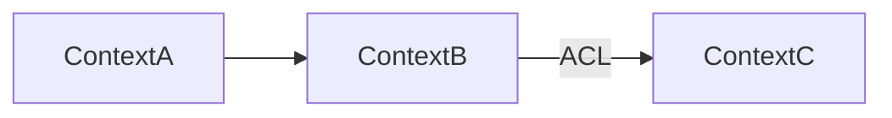

# Strategic Design - Thiết kế Chiến lược

## Mục tiêu
Xác định Bounded Contexts, Context Map, và Ubiquitous Language.

## Input → Output
- **Input:** Event storming output, SPEC.md
- **Output:** Context Map, Ubiquitous Language

## Parallel Triggers
- Phụ thuộc `02_design/01_event-storming.md`
- Có thể chạy song song với `03_tactical.md` nếu contexts đã rõ

## Quality Gates
- [ ] Mỗi context có clear responsibility
- [ ] Relationships giữa contexts đã xác định
- [ ] Shared types đã identified

## Key Questions
- Ranh giới của từng context?
- Contexts tương tác với nhau như thế nào?
- Thuật ngữ chung là gì?

---

## Workflow

### Bước 1: Bounded Context Identification
Phân nhóm events/commands thành contexts:
- Core Domain: Business differentiator
- Supporting Domain: Hỗ trợ core
- Generic Domain: Commodity (không competitive advantage)

### Bước 2: Context Mapping
Xác định relationships:
- Upstream/Downstream
- Customer/Supplier
- Conformist
- Anti-Corruption Layer

### Bước 3: Ubiquitous Language
Liệt kê terms và definitions

---

## Output Format

```markdown
# Strategic Design - [Project Name]

## 1. Bounded Contexts
| Context | Type | Responsibility |
|---------|------|----------------|
| ... | Core/Supporting/Generic | ... |

## 2. Context Map


## 3. Relationships
| From | To | Type | Integration |
|-------|-----|------|-------------|
| ... | ... | ... | ... |

## 4. Ubiquitous Language
| Term | Context | Definition |
|------|---------|------------|
| ... | ... | ... |

## 5. Core Domain Summary
[Giải thích tại sao đây là core domain]
```
